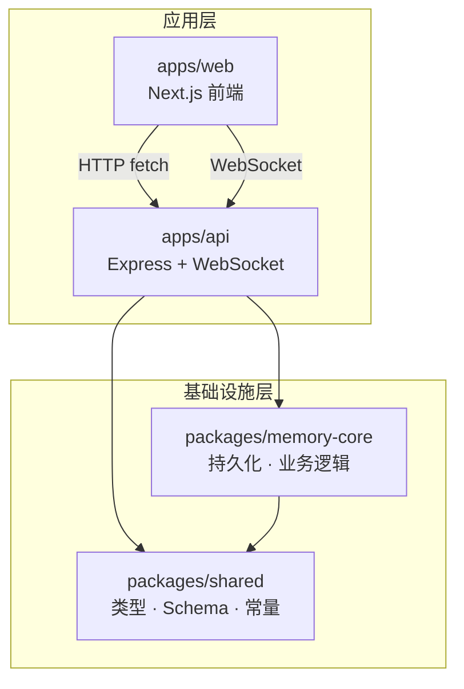
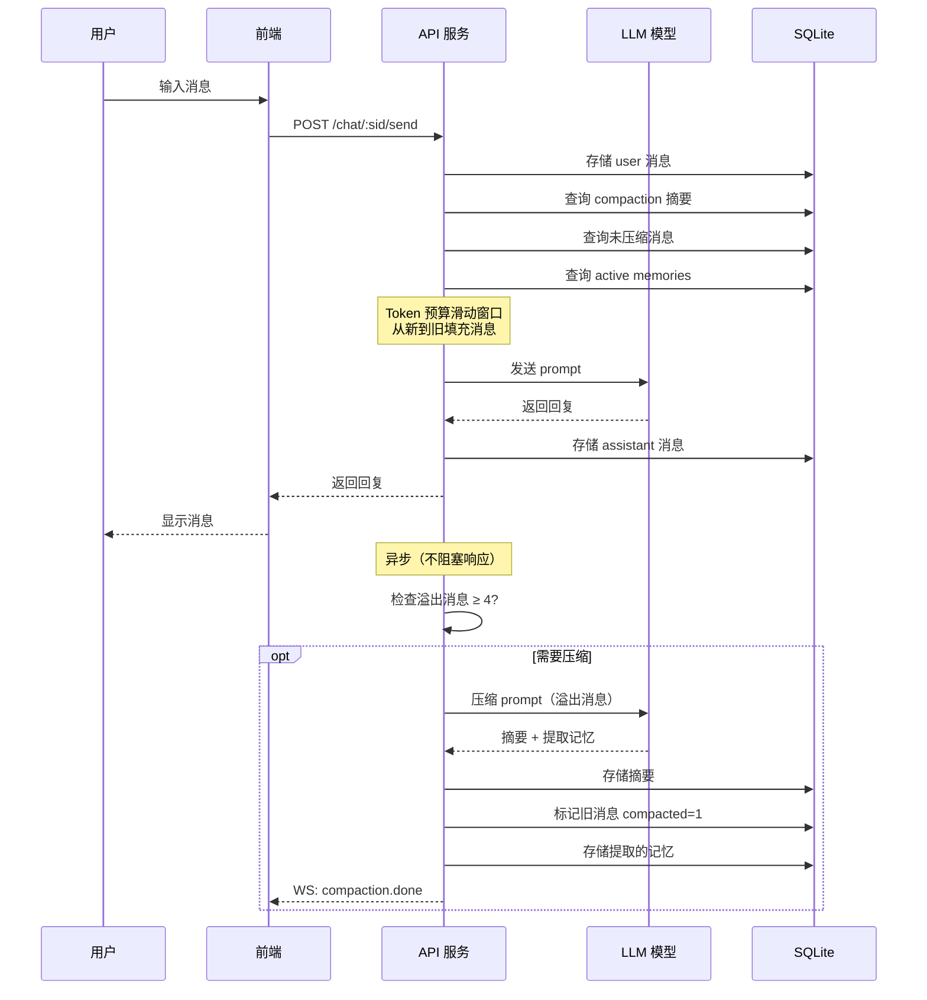
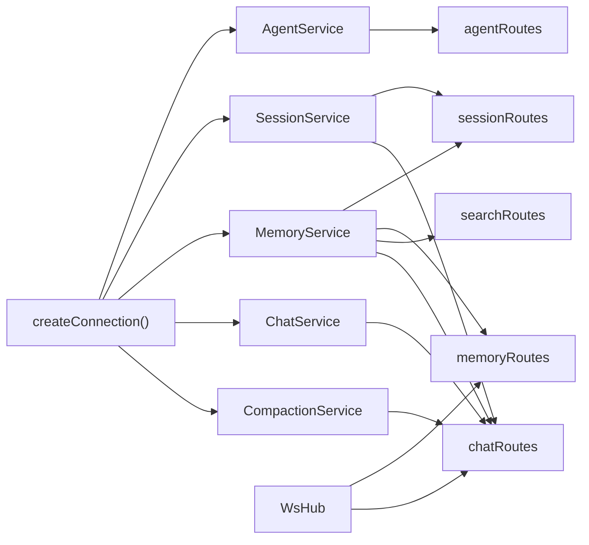
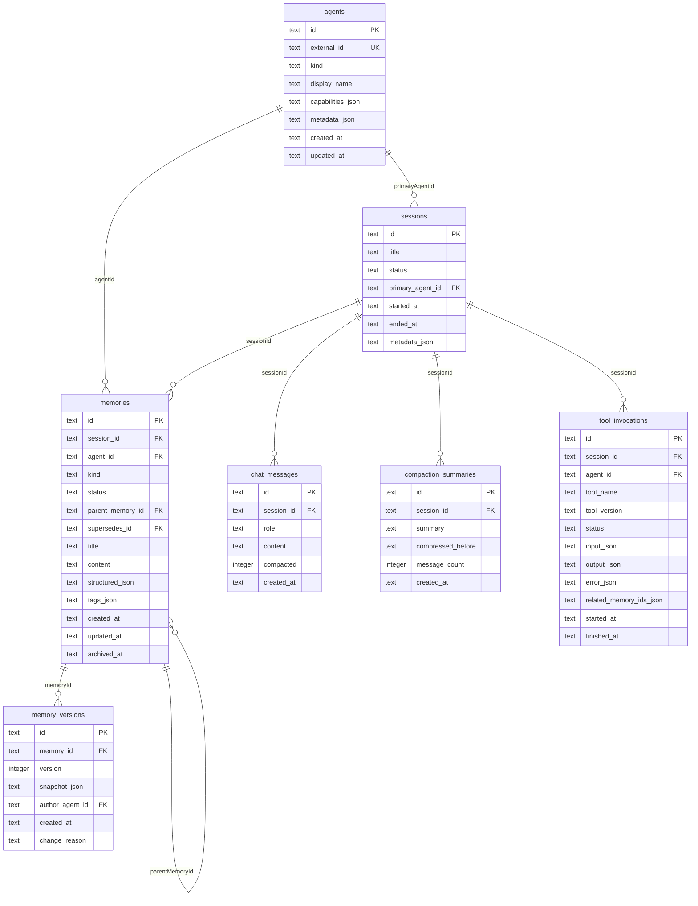

# 系统架构

## 整体结构

Agent Memory Studio 采用 pnpm monorepo 架构，分为 4 个包：



| 包 | 职责 | 关键技术 |
|----|------|---------|
| `apps/web` | 用户界面：Session 管理、聊天面板、语音输入 | Next.js 15, React 19 |
| `apps/api` | HTTP + WebSocket 服务：路由、LLM 调用、压缩调度 | Express, OpenAI SDK, ws |
| `packages/shared` | 领域类型、Zod 验证 schema、错误定义、API 常量 | Zod, TypeScript |
| `packages/memory-core` | SQLite 连接、Drizzle ORM schema、5 个业务 Service | better-sqlite3, Drizzle ORM |

## 模块关系

### packages/shared

定义了整个系统的类型契约，不包含任何运行时逻辑：

```
shared/src/
├── domain/types.ts    # 核心接口：AgentProfile, Session, MemoryEntry, ToolInvocation
├── schemas/
│   ├── agent.zod.ts   # Agent CRUD 验证
│   ├── session.zod.ts # Session CRUD 验证
│   └── memory.zod.ts  # Memory CRUD 验证
├── errors.ts          # AppError（VALIDATION / NOT_FOUND / CONFLICT / STORAGE）
├── constants.ts       # API_VERSION, API_PREFIX, WS_EVENTS, DEFAULTS
└── index.ts           # 统一导出
```

### packages/memory-core

持久化层 + 业务逻辑，不依赖任何 HTTP 框架：

```
memory-core/src/
├── adapters/sqlite/
│   ├── schema.ts      # Drizzle 表定义（7 张表）
│   └── connection.ts  # SQLite 连接 + DDL 初始化 + 迁移
├── services/
│   ├── agent-service.ts      # Agent CRUD
│   ├── session-service.ts    # Session CRUD + 列表
│   ├── memory-service.ts     # Memory CRUD + 版本追踪 + 搜索
│   ├── chat-service.ts       # 聊天消息读写
│   └── compaction-service.ts # 会话压缩 + 记忆提取
└── index.ts                  # 统一导出
```

### apps/api

HTTP 服务层，组装 Service 并暴露为 REST + WebSocket：

```
api/src/
├── index.ts                  # 入口：创建连接 → 实例化 Service → 挂载路由
├── http/
│   ├── routes/
│   │   ├── health.ts         # GET /health
│   │   ├── agents.ts         # /api/v1/agents CRUD
│   │   ├── sessions.ts       # /api/v1/sessions CRUD + memories
│   │   ├── memories.ts       # /api/v1/memories CRUD + versions
│   │   ├── search.ts         # /api/v1/search?q=...
│   │   └── chat.ts           # /api/v1/chat — 聊天 + 压缩 + 转写
│   └── middleware/
│       ├── error-handler.ts  # AppError → HTTP 状态码映射
│       └── validate.ts       # Zod schema 验证中间件
└── ws/
    └── hub.ts                # WebSocket 订阅/广播
```

### apps/web

Next.js App Router 前端：

```
web/
├── app/
│   ├── layout.tsx            # 根布局
│   ├── page.tsx              # 首页仪表板（Session 列表 + Agent 列表）
│   ├── globals.css           # 全局样式（暗色主题）
│   └── sessions/
│       └── [sessionId]/
│           └── page.tsx      # Session 详情 + 聊天面板
├── components/
│   ├── ChatPanel.tsx         # 聊天界面（消息列表 + 输入 + 模型选择）
│   ├── VoiceInput.tsx        # 语音输入（Web Speech API + Whisper 回退）
│   └── NewSessionButton.tsx  # 快速创建 Session
└── lib/
    └── api-client.ts         # 前端 API 客户端
```

## 数据流

### 聊天消息流



### 依赖注入



所有 Service 共享同一个 `SqliteDb` 实例，在 `apps/api/src/index.ts` 中一次性创建并注入到各路由工厂函数。

## 数据库 Schema

7 张表，SQLite 单文件存储：



## WebSocket 协议

连接端点：`ws://localhost:4000/ws?sessionId=xxx`

| 方向 | 消息类型 | 格式 |
|------|---------|------|
| S→C | 连接确认 | `{ type: "connected" }` |
| C→S | 订阅 | `{ type: "subscribe", sessionId: "..." }` |
| C→S | 取消订阅 | `{ type: "unsubscribe", sessionId: "..." }` |
| S→C | 事件广播 | `{ event, sessionId, data, ts }` |

### 事件列表

| 事件名 | 触发时机 | data 内容 |
|--------|---------|----------|
| `memory.created` | 创建记忆 | `MemoryEntry` |
| `memory.updated` | 更新记忆 | `MemoryEntry` |
| `memory.archived` | 归档记忆 | `MemoryEntry` |
| `chat.message` | 用户/助手消息 | `ChatMessage` |
| `compaction.done` | 压缩完成 | `{ messageCount, memoriesExtracted }` |
