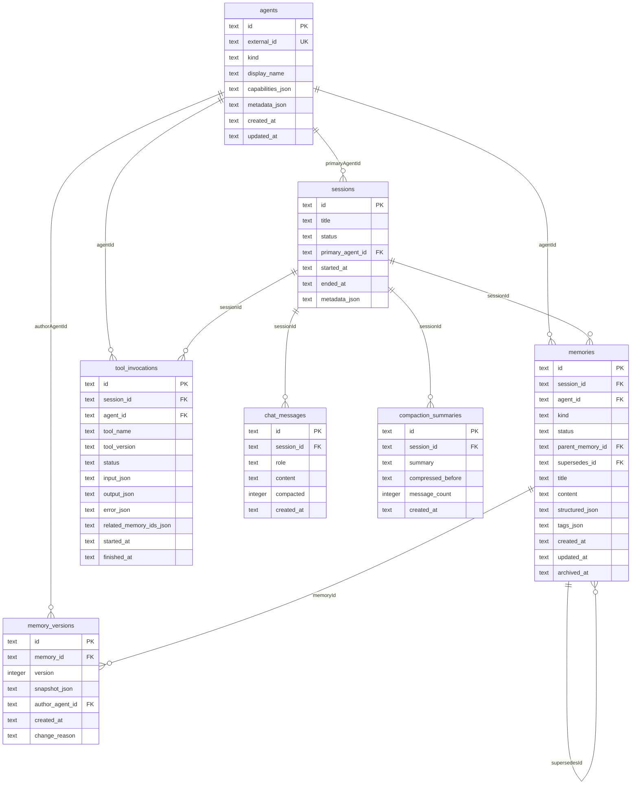

# 数据库设计

SQLite 单文件存储，默认路径 `data/studio.db`。启用 WAL 模式和外键约束。

## ER 图



## 表详细说明

### agents — Agent 身份

| 列 | 类型 | 约束 | 说明 |
|----|------|------|------|
| `id` | TEXT | PK | UUID |
| `external_id` | TEXT | UNIQUE, 可空 | 外部系统 ID（如 GitHub 用户名） |
| `kind` | TEXT | NOT NULL | `human` / `bot` / `orchestrator` / `subagent` |
| `display_name` | TEXT | NOT NULL | 显示名称 |
| `capabilities_json` | TEXT | NOT NULL, 默认 `[]` | JSON 数组，`[{name, description}]` |
| `metadata_json` | TEXT | NOT NULL, 默认 `{}` | 任意键值对 |
| `created_at` | TEXT | NOT NULL | ISO 8601 |
| `updated_at` | TEXT | NOT NULL | ISO 8601 |

---

### sessions — 会话

| 列 | 类型 | 约束 | 说明 |
|----|------|------|------|
| `id` | TEXT | PK | UUID |
| `title` | TEXT | 可空 | 会话标题 |
| `status` | TEXT | NOT NULL, 默认 `open` | `open` / `closed` |
| `primary_agent_id` | TEXT | FK → agents.id | 主 Agent |
| `started_at` | TEXT | NOT NULL | ISO 8601 |
| `ended_at` | TEXT | 可空 | 关闭时自动设置 |
| `metadata_json` | TEXT | NOT NULL, 默认 `{}` | 任意键值对 |

---

### memories — 长期记忆

核心表，存储从对话中自动提取或手动创建的结构化记忆。

| 列 | 类型 | 约束 | 说明 |
|----|------|------|------|
| `id` | TEXT | PK | UUID |
| `session_id` | TEXT | FK → sessions.id | 所属会话 |
| `agent_id` | TEXT | FK → agents.id | 创建者 |
| `kind` | TEXT | NOT NULL | `summary` / `fact` / `hypothesis` / `constraint` / `goal` / `note` |
| `status` | TEXT | NOT NULL, 默认 `active` | `draft` / `active` / `archived` / `deleted` |
| `parent_memory_id` | TEXT | FK → memories.id | 父记忆（树状结构） |
| `supersedes_id` | TEXT | FK → memories.id | 被此记忆取代的旧记忆 |
| `title` | TEXT | 可空 | 简短标题 |
| `content` | TEXT | NOT NULL | 记忆正文 |
| `structured_json` | TEXT | 可空 | `MemorySummaryPayload` JSON |
| `tags_json` | TEXT | NOT NULL, 默认 `[]` | 标签数组，如 `["auto-extracted"]` |
| `created_at` | TEXT | NOT NULL | ISO 8601 |
| `updated_at` | TEXT | NOT NULL | ISO 8601 |
| `archived_at` | TEXT | 可空 | 归档时间 |

**自引用关系**：
- `parent_memory_id` — 构建记忆层级树
- `supersedes_id` — 标记哪条记忆被当前记忆替代（纠错/更新）

---

### memory_versions — 记忆版本

每次更新 `memories` 时自动创建快照，实现完整审计追踪。

| 列 | 类型 | 约束 | 说明 |
|----|------|------|------|
| `id` | TEXT | PK | UUID |
| `memory_id` | TEXT | FK → memories.id | 关联记忆 |
| `version` | INTEGER | NOT NULL, UNIQUE(memory_id, version) | 递增版本号 |
| `snapshot_json` | TEXT | NOT NULL | 该版本的完整 MemoryEntry 快照 |
| `author_agent_id` | TEXT | FK → agents.id | 修改者 |
| `created_at` | TEXT | NOT NULL | ISO 8601 |
| `change_reason` | TEXT | 可空 | 修改原因，如 `"created"` / `"用户修正"` |

---

### chat_messages — 聊天消息（短期记忆）

| 列 | 类型 | 约束 | 说明 |
|----|------|------|------|
| `id` | TEXT | PK | UUID |
| `session_id` | TEXT | FK → sessions.id | 所属会话 |
| `role` | TEXT | NOT NULL | `user` / `assistant` / `system` |
| `content` | TEXT | NOT NULL | 消息内容 |
| `compacted` | INTEGER | NOT NULL, 默认 0 | 0=未压缩，1=已被压缩摘要覆盖 |
| `created_at` | TEXT | NOT NULL | ISO 8601 |

**`compacted` 字段的作用**：
- 构建 prompt 时，只查询 `compacted=0` 的消息（未压缩的近期消息）
- 压缩完成后，旧消息标记为 `compacted=1`，不再进入 LLM 上下文
- 消息**不会被物理删除**，可随时查看完整历史

---

### compaction_summaries — 压缩摘要

| 列 | 类型 | 约束 | 说明 |
|----|------|------|------|
| `id` | TEXT | PK | UUID |
| `session_id` | TEXT | FK → sessions.id | 所属会话 |
| `summary` | TEXT | NOT NULL | LLM 生成的对话摘要 |
| `compressed_before` | TEXT | NOT NULL | ISO 时间戳：此时间之前的消息已被压缩 |
| `message_count` | INTEGER | NOT NULL | 本次压缩的消息数 |
| `created_at` | TEXT | NOT NULL | ISO 8601 |

**渐进式摘要**：每次压缩产生一条新记录。`getLatestSummary()` 取最新一条用于 prompt，因为新摘要已包含前次摘要的上下文。

---

### tool_invocations — 工具调用记录

| 列 | 类型 | 约束 | 说明 |
|----|------|------|------|
| `id` | TEXT | PK | UUID |
| `session_id` | TEXT | FK → sessions.id | 所属会话 |
| `agent_id` | TEXT | FK → agents.id | 调用者 |
| `tool_name` | TEXT | NOT NULL | 工具名称 |
| `tool_version` | TEXT | 可空 | 工具版本 |
| `status` | TEXT | NOT NULL | `pending` / `running` / `succeeded` / `failed` / `cancelled` |
| `input_json` | TEXT | NOT NULL | 调用入参 JSON |
| `output_json` | TEXT | 可空 | 返回结果 JSON |
| `error_json` | TEXT | 可空 | `{ code, message }` |
| `related_memory_ids_json` | TEXT | NOT NULL, 默认 `[]` | 关联记忆 ID 数组 |
| `started_at` | TEXT | NOT NULL | ISO 8601 |
| `finished_at` | TEXT | 可空 | 完成时间 |

> 注：此表 schema 已定义，Service 层尚未实现 CRUD。

## 索引

| 索引名 | 表 | 列 | 用途 |
|--------|----|----|------|
| `idx_chat_messages_session` | chat_messages | `(session_id, created_at)` | 按会话查历史 |
| `idx_compaction_session` | compaction_summaries | `(session_id, created_at DESC)` | 取最新摘要 |
| `idx_memories_session` | memories | `(session_id, status, updated_at)` | 按会话+状态查记忆 |
| `idx_memories_agent` | memories | `(agent_id, updated_at)` | 按 Agent 查记忆 |
| `idx_memories_parent` | memories | `(parent_memory_id)` | 记忆树遍历 |
| `idx_memory_versions_mid` | memory_versions | `(memory_id, version DESC)` | 取最新版本 |
| `idx_tool_invocations_session` | tool_invocations | `(session_id, started_at)` | 按会话查工具调用 |

## 迁移策略

使用幂等 SQL 处理已有数据库的 schema 演进：

```sql
-- INIT_SQL 中用 CREATE TABLE IF NOT EXISTS 保证可重复执行

-- MIGRATE_SQL 中用 ALTER TABLE 添加新列，catch 忽略已存在的错误
ALTER TABLE chat_messages ADD COLUMN compacted INTEGER NOT NULL DEFAULT 0;
```

所有 DDL 在 `createConnection()` 时自动执行，无需手动迁移。

## 文件位置

- Drizzle 表定义：`packages/memory-core/src/adapters/sqlite/schema.ts`
- DDL + 连接：`packages/memory-core/src/adapters/sqlite/connection.ts`
- 默认数据库路径：`apps/api/data/studio.db`（通过 `DB_PATH` 环境变量覆盖）
