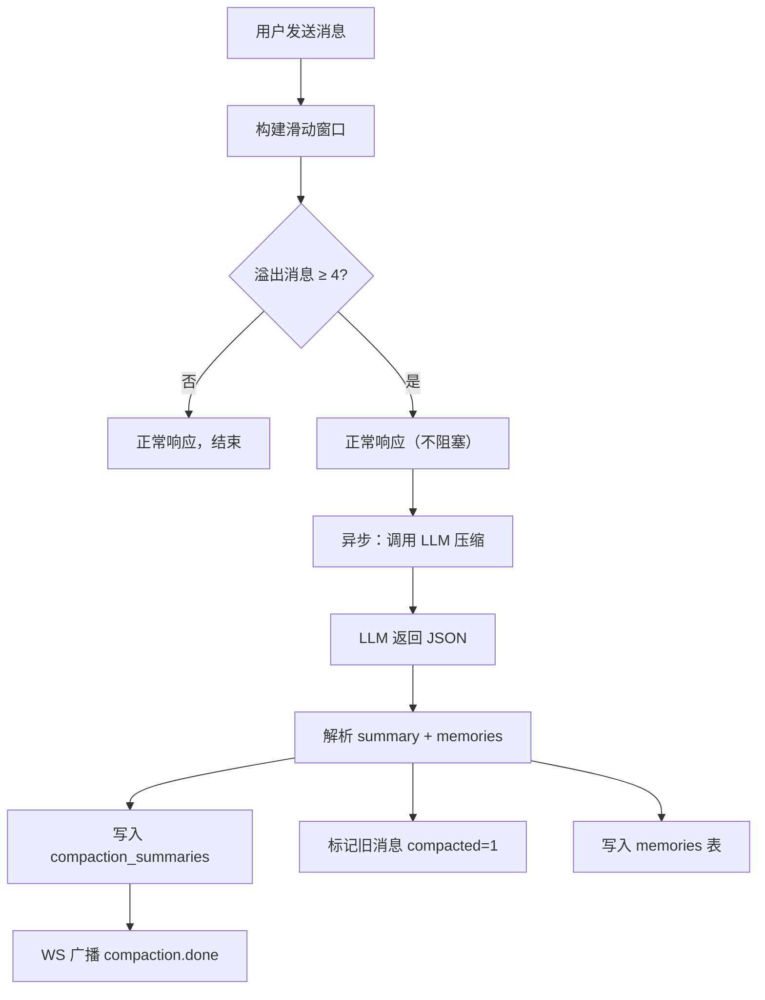
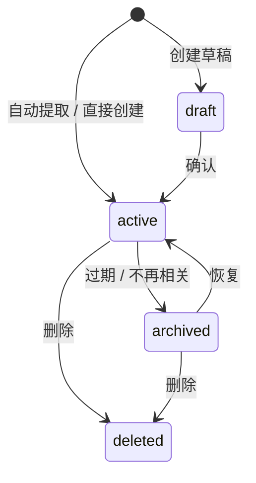

# 记忆系统设计

## 设计理念

参考 Anthropic 的 [Effective Context Engineering for AI Agents](https://anthropic.com/engineering/effective-context-engineering-for-ai-agents) 和 Claude 的 Compaction API，核心原则：

> **上下文是有限的注意力预算。用最小的高信噪比 token 集合，最大化期望结果的概率。**

## 三层记忆架构

```
┌─────────────────────────────────────────────────────┐
│                    LLM Prompt                        │
│  ┌───────────────────────────────────────────────┐  │
│  │ System Prompt                                  │  │
│  ├───────────────────────────────────────────────┤  │
│  │ <conversation_summary>                         │  │  ← 压缩层
│  │   之前所有对话的精华摘要                          │  │
│  │ </conversation_summary>                        │  │
│  ├───────────────────────────────────────────────┤  │
│  │ <session_memory>                               │  │  ← 长期记忆
│  │   - [fact] 用户使用 React + TypeScript           │  │
│  │   - [goal] 构建多 agent 记忆管理系统               │  │
│  │   - [constraint] 必须使用 SQLite                  │  │
│  │ </session_memory>                              │  │
│  ├───────────────────────────────────────────────┤  │
│  │ 最近 N 条消息原文（滑动窗口内）                     │  │  ← 短期记忆
│  │   user: ...                                    │  │
│  │   assistant: ...                               │  │
│  │   user: ...                                    │  │
│  └───────────────────────────────────────────────┘  │
└─────────────────────────────────────────────────────┘
```

| 层级 | 存储位置 | 生命周期 | 写入方式 |
|------|---------|---------|---------|
| 短期记忆 | `chat_messages` 表 | 单次对话 | 每条消息实时写入 |
| 压缩层 | `compaction_summaries` 表 | 跨轮次 | 滑动窗口溢出时 LLM 自动生成 |
| 长期记忆 | `memories` 表 | 持久 | 压缩时 LLM 自动提取 + 手动创建 |

## Token 预算式滑动窗口

### 工作原理

每次构建 prompt 时，不是取固定条数的消息，而是按 **token 预算** 从最新消息往回填充：

```
总预算：12000 token
├── 保留区：2000 token（system prompt + 摘要 + memories 固定开销）
└── 消息区：10000 token（滑动窗口）
```

```typescript
// 从最新消息往回填充
for (let i = messages.length - 1; i >= 0; i--) {
  const cost = estimateTokens(messages[i].content) + 10; // +10 = role 开销
  if (remaining - cost < 0 && messagesToSend.length > 0) break;
  remaining -= cost;
  messagesToSend.unshift(messages[i]);
}
```

### 与传统方案的对比

| 方案 | prompt 大小 | 旧消息处理 | token 浪费 |
|------|-----------|-----------|-----------|
| 固定条数（取最近 30 条） | 不可控（可能超限） | 直接丢弃 | 高 |
| 条数阈值压缩（每 20 条压缩一次） | 两次压缩之间 3x 膨胀 | 批量压缩 | 中 |
| **Token 预算滑动窗口（当前）** | **恒定 ≤ 预算** | **溢出时压缩** | **低** |

### Token 估算

不依赖 tiktoken 等 native 包，使用简单公式：

```typescript
function estimateTokens(text: string): number {
  return Math.ceil(text.length / 3.5);
}
```

对混合中英文文本，`chars / 3.5` 的误差在 ±15% 以内，足够用于预算控制。

## 压缩流程

### 触发条件

每次发送消息后，检查滑动窗口溢出的消息数：

```
溢出消息数 ≥ COMPACT_MIN_MESSAGES (默认 4) → 触发压缩
```

### 执行步骤



### LLM Prompt

压缩使用单独的 LLM 调用（推荐用便宜模型如 `gpt-4o-mini`），prompt 要求同时输出摘要和结构化记忆：

```
System: You are a conversation compressor for an AI memory system.

你需要：
1. 写一段 2-4 段的摘要，保留所有重要信息
2. 提取离散的记忆条目（fact / goal / constraint / note）

规则：
- 保留技术细节：文件路径、函数名、库名、错误信息
- 保留决策及其推理过程
- 保留用户偏好和需求
- 去除寒暄、填充语和冗余往返
- 使用对话原始语言

输出 JSON（无 markdown 包裹）：
{
  "summary": "...",
  "memories": [
    { "kind": "fact", "content": "...", "title": "..." }
  ]
}
```

### 渐进式摘要

多次压缩后，摘要是**追加式**的。每次压缩只处理当前溢出的消息，而前一次的摘要已经在 prompt 的 `<conversation_summary>` 中，供 LLM 参考：

```
第 1 次压缩：消息 1-14 → 摘要 A
第 2 次压缩：消息 15-28 → 摘要 B（LLM 能看到摘要 A 作为上下文）
```

`getLatestSummary()` 只取最新一条摘要，因为它已经包含了之前所有压缩的累积信息。

## 记忆类型

| kind | 用途 | 示例 |
|------|------|------|
| `fact` | 客观事实、技术细节 | "项目使用 pnpm workspace + Next.js 15" |
| `goal` | 用户目标、期望 | "实现多模型支持" |
| `constraint` | 限制条件、硬性要求 | "数据库必须使用 SQLite" |
| `note` | 一般性笔记 | "用户偏好暗色主题" |
| `summary` | 手动创建的摘要 | 项目阶段总结 |
| `hypothesis` | 假设（待验证） | "性能瓶颈可能在数据库查询" |

### 记忆生命周期



### 记忆版本追踪

每次更新记忆时，自动在 `memory_versions` 表创建快照：

```
Memory "用户技术栈"
├── v1: "React + JavaScript"     (created)
├── v2: "React + TypeScript"     (用户修正)
└── v3: "React 19 + TypeScript"  (版本更新)
```

## 配置参考

| 环境变量 | 默认值 | 说明 |
|---------|-------|------|
| `CONTEXT_TOKEN_BUDGET` | 6000 | 总 token 预算 |
| `CONTEXT_RESERVED_TOKENS` | 2000 | system prompt / 摘要 / memories 保留 |
| `COMPACT_MIN_MESSAGES` | 4 | 最少溢出消息数触发压缩 |
| `COMPACT_MODEL` | 与聊天模型相同 | 压缩用模型（推荐便宜模型） |

### 预算规划建议

| 场景 | 推荐 TOKEN_BUDGET | 消息区 | 约几轮对话 |
|------|-------------------|-------|-----------|
| 闲聊 | 6000 | 4000 | ~27 轮 |
| 一般技术讨论 | 12000 | 10000 | ~15 轮 |
| 深度编程（长代码） | 20000 | 18000 | ~15 轮 |

## 与 Claude 策略的对比

| 维度 | Claude Compaction API | Agent Memory Studio |
|------|----------------------|---------------------|
| 触发方式 | input_tokens 阈值（默认 150K） | token 预算滑动窗口（默认 12K） |
| 压缩执行 | 服务端自动 | 应用层异步 LLM 调用 |
| 记忆提取 | Memory Tool（文件系统） | 压缩时自动提取到数据库 |
| 记忆存储 | `/memories` 目录文件 | SQLite `memories` 表（结构化） |
| 版本追踪 | Git | 内建 `memory_versions` 表 |
| 作用域 | 多层级（组织/项目/用户） | Session 级 |

我们的设计更偏向 **API 层的自动化运行时记忆引擎**，而非 Claude Code 的开发者工具层文件式记忆。核心原则一致：压缩而非删除、结构化提取、分层组装 prompt。
